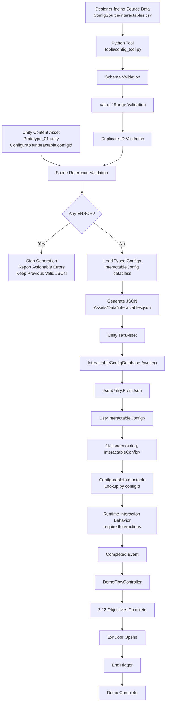

# Pipeline V1

English | [简体中文](Pipeline_V1.zh-CN.md)

> **Historical milestone snapshot.** This document describes the Week 1 single-table Pipeline V1 architecture and is preserved to show project evolution. It is **not** the current Pipeline specification. For the current V2 design and measured results, see [`Pipeline_Case_Study.md`](Pipeline_Case_Study.md).

## 1. Overview

This document describes the first complete end-to-end content pipeline of `TD-Pipeline-Demo`.

The pipeline connects designer-facing configuration data, Python validation and conversion, generated JSON data, Unity configuration loading, and final runtime gameplay behavior.

Pipeline V1 was verified through an actual source-data modification test without manually editing generated JSON or gameplay C# code.

---

## 2. End-to-End Content Pipeline



---

## 3. Pipeline Stages

### 3.1 Designer-Facing Source Data

The editable source configuration is:

```text
ConfigSource/interactables.csv
```

The CSV defines:

- `id`
- `displayName`
- `requiredInteractions`
- `deactivateOnComplete`

The CSV is treated as the source of truth for interactable configuration.

Generated JSON should not be manually edited as part of the normal workflow.

### 3.2 Python Validation

The pipeline tool is:

```text
Tools/config_tool.py
```

Before generating JSON, the tool performs several validation stages.

#### Schema Validation

Checks:

- CSV header exists
- required columns exist
- required values are not empty

#### Value / Range Validation

Checks:

- `requiredInteractions` can be converted to an integer
- `requiredInteractions` is not below the valid minimum
- unusually high interaction counts are reported
- `deactivateOnComplete` is either `true` or `false`

#### Duplicate-ID Validation

Checks whether multiple configuration rows use the same `id`.

Duplicate IDs are treated as `ERROR` because configuration IDs are used as lookup and reference keys.

#### Scene Reference Validation

Pipeline V1 reads:

```text
Assets/Scenes/Prototype_01.unity
```

and checks serialized `ConfigurableInteractable.configId` values.

Each Scene `configId` must correspond to an ID defined in the source CSV.

This allows broken references caused by deleted or renamed configuration IDs to be detected before Unity Runtime.

---

## 4. Validation Gate

Validation issues use two severity levels:

```text
ERROR
WARNING
```

### ERROR

An `ERROR` means the generated configuration should not be trusted.

Examples include:

- missing required fields
- invalid integer values
- invalid boolean values
- invalid interaction ranges
- duplicate IDs
- broken Unity Scene references

If any `ERROR` exists:

```text
Validation fails
↓
JSON generation stops
↓
Previous valid JSON remains unchanged
```

### WARNING

A `WARNING` represents suspicious but technically usable data.

For example:

```text
requiredInteractions = 50
```

is unusually high for the current interaction design, but does not make the data structurally invalid.

Therefore:

```text
WARNING
↓
Report issue
↓
Continue JSON generation
```

---

## 5. Generated Data

If validation succeeds, the Python tool converts the source CSV into typed `InteractableConfig` objects and generates:

```text
Assets/Data/interactables.json
```

The generated JSON is the Unity-consumable output of the configuration pipeline.

Transformation:

```text
CSV strings
↓
Python type conversion
↓
InteractableConfig dataclass
↓
Dictionary representation
↓
JSON
```

---

## 6. Unity Configuration Loading

Unity consumes the generated JSON through:

```text
InteractableConfigDatabase
```

At Runtime:

```text
interactables.json
↓
TextAsset
↓
InteractableConfigDatabase.Awake()
↓
JsonUtility.FromJson
↓
InteractableConfigCollection
↓
List<InteractableConfig>
↓
Dictionary<string, InteractableConfig>
```

The Dictionary uses configuration IDs as keys, allowing runtime objects to retrieve configuration by `configId`.

---

## 7. Runtime Content

Each configurable gameplay object contains a serialized:

```text
configId
```

Example:

```text
SturdyCube
↓
configId = cube_sturdy
```

At Runtime:

```text
ConfigurableInteractable
↓
Request config by configId
↓
InteractableConfigDatabase
↓
Dictionary lookup
↓
InteractableConfig
↓
Apply requiredInteractions
```

Gameplay logic does not need to change when the configuration value changes.

---

## 8. Gameplay Completion Flow

After an interactable reaches its configured completion condition:

```text
ConfigurableInteractable
↓
Completed event
↓
DemoFlowController
↓
completedObjectives++
```

After both objectives are complete:

```text
2 / 2 objectives
↓
ExitDoor disabled
↓
Exit opened
```

The player can then reach the end trigger:

```text
EndTrigger
↓
DemoFlowController.TryFinishMission()
↓
Demo Complete
```

---

## 9. Day 6 End-to-End Verification

Pipeline V1 was verified through a real source-data modification test.

### Baseline

```text
cube_sturdy.requiredInteractions = 3
```

### Test Procedure

1. Run the Python tool with the valid baseline configuration.
2. Confirm validation passes and JSON generation succeeds.
3. Modify only the designer-facing CSV:

```text
cube_sturdy.requiredInteractions
3 → 5
```

4. Do not manually edit generated JSON.
5. Do not modify gameplay C# code.
6. Run:

```text
py Tools/config_tool.py
```

7. Confirm generated JSON changes automatically to:

```text
requiredInteractions = 5
```

8. Run the Unity prototype.
9. Enter the mission through `StartGate`.
10. Complete `QuickCube`.
11. Verify `SturdyCube` requires exactly 5 interactions.
12. Complete both objectives.
13. Verify the exit opens normally.
14. Enter the end trigger.
15. Verify the full gameplay loop reaches `Demo Complete`.
16. Restore the source CSV value from `5 → 3`.
17. Regenerate JSON.
18. Confirm the pipeline returns to the original valid configuration.

---

## 10. Verified Pipeline

The Day 6 test verifies the following chain:

```text
Designer Source Data
↓
Python Validation
↓
Automatic Conversion
↓
Generated JSON
↓
Unity Configuration Loading
↓
Runtime Config Lookup
↓
Gameplay Behavior
↓
Objective Completion
↓
Level Flow
↓
Demo Complete
```

The important result is that changing only designer-facing source data produced a real runtime gameplay change without manually editing generated data or rewriting gameplay code.

---

## 11. Pipeline V1 Boundaries

Pipeline V1 was intentionally limited to the Week 1 demo scope.

Historical boundaries included:

- reference validation scanned `Prototype_01.unity` rather than all Scenes and Prefabs;
- missing or completely malformed source files were not handled comprehensively;
- the Unity configuration database assumed its `TextAsset` reference was correctly assigned;
- the Pipeline had no graphical user interface;
- validation functions read the CSV separately rather than sharing one parsed intermediate representation;
- Unity reference validation was specific to this project's serialized `ConfigurableInteractable.configId` structure.

Several of these boundaries were later addressed by Pipeline V2. See the current Case Study for the final architecture and evidence.

---

## 12. Pipeline V1 Summary

```text
Designer-facing CSV
        +
Unity Scene References
        ↓
Python Preflight Validation
        ↓
ERROR / WARNING Gate
        ↓
Typed Configuration
        ↓
Generated JSON
        ↓
Unity Runtime Loading
        ↓
Config-Driven Gameplay
        ↓
Playable Demo Completion
```

Pipeline V1 demonstrated a small content-production workflow in which configuration errors could be detected before Runtime and source-data changes could propagate into real gameplay behavior. It is preserved as the historical baseline from which the later V2 architecture evolved.
