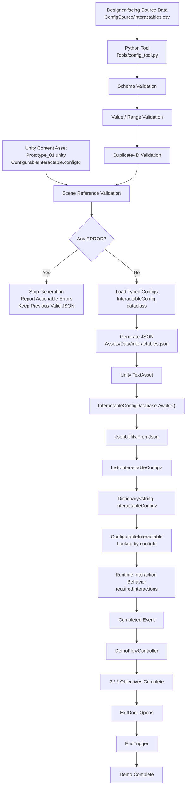

# Pipeline V1 — Week 1 Snapshot

English | [简体中文](Pipeline_V1.zh-CN.md)

> Scope: the Week 1 single-table pipeline and its Day 6 verification. Current tool V3 is described in the [case study](Pipeline_Case_Study.md), [implementation](技术实现.md), and [user guide](使用说明.md). Commands and component behavior below describe the V1 milestone.

## 1. Overview and flow

V1 connected designer-authored CSV, Python validation/type conversion, generated JSON, Unity configuration loading, and gameplay completion. A source-only change was tested in the playable prototype while generated data and gameplay C# were left to the existing pipeline and runtime.



## 2. Source data and validation

`ConfigSource/interactables.csv` was the editable source, with four fields: `id`, `displayName`, `requiredInteractions`, and `deactivateOnComplete`. Normal content work changed this CSV and regenerated `Assets/Data/interactables.json` through `Tools/config_tool.py`.

Before generation, the V1 tool checked:

| Check | Requirement |
| --- | --- |
| Schema | Header and required columns present; required values nonempty |
| Integer/range | `requiredInteractions` converts to an integer and meets the minimum; unusually high counts are reported |
| Boolean | `deactivateOnComplete` is `true` or `false` |
| Unique IDs | Each `id` is unique because it is both a lookup key and a reference key |
| Scene references | Every serialized `ConfigurableInteractable.configId` in `Assets/Scenes/Prototype_01.unity` exists in the CSV |

Scene checks caught references broken by deleting or renaming configuration IDs before runtime.

An **ERROR**—a missing field, invalid integer/boolean/range, duplicate ID, or broken scene reference—stopped generation and preserved the previous valid JSON. A **WARNING** reported suspicious but usable data and allowed generation to continue; `requiredInteractions = 50` was the high-count example.

After the validation gate, CSV strings were converted to typed `InteractableConfig` dataclass instances, then dictionary representations, then JSON.

## 3. Unity loading and gameplay

The loading path was:

```text
interactables.json → TextAsset → InteractableConfigDatabase.Awake()
→ JsonUtility.FromJson → InteractableConfigCollection
→ List<InteractableConfig> → Dictionary<string, InteractableConfig>
```

The dictionary used config IDs as keys. Each scene object had a serialized `configId`; for example, `SturdyCube` used `cube_sturdy`. `ConfigurableInteractable` requested that ID from `InteractableConfigDatabase`, received the config, and applied `requiredInteractions`. Changing the value required no gameplay-code change.

Completion followed this sequence:

```text
ConfigurableInteractable reaches its configured interaction count
→ Completed event → DemoFlowController → completedObjectives++
→ 2 / 2 objectives complete → ExitDoor disabled → exit opens
→ player enters EndTrigger → DemoFlowController.TryFinishMission()
→ Demo Complete
```

## 4. Day 6 end-to-end verification

Baseline: `cube_sturdy.requiredInteractions = 3`.

1. Run the Python tool with the valid baseline and confirm validation and generation pass.
2. Change only the CSV value from `3 → 5`; leave generated JSON and gameplay C# untouched.
3. Run `py Tools/config_tool.py` and confirm JSON now contains `requiredInteractions = 5`.
4. Run the Unity prototype, enter through `StartGate`, and complete `QuickCube`.
5. Verify `SturdyCube` requires exactly five interactions. Complete both objectives and check that the exit opens.
6. Enter the end trigger and confirm `Demo Complete`.
7. Restore the CSV value from `5 → 3`, regenerate JSON, and confirm the original valid configuration is restored.

This verified source editing, validation, automatic conversion, JSON loading, runtime lookup, changed interaction behavior, objective completion, and level completion in one test.

## 5. V1 boundaries and later changes

At the Week 1 milestone:

- reference validation covered only `Prototype_01.unity` and this project's serialized `ConfigurableInteractable.configId` format;
- missing or completely malformed source files were not comprehensively handled;
- the Unity database assumed its `TextAsset` reference was assigned correctly;
- no GUI existed;
- validation functions read CSV independently, without a shared parsed representation;
- all-scene and all-prefab scanning were outside scope.

V2 later introduced the shared multi-table model and expanded item/scene checks. V3 added a standalone GUI/EXE, external rules, drafts, and optional AI rule authoring while preserving the Unity runtime contract. This record retains the V1 architecture and the source-to-gameplay verification that established the original baseline.
