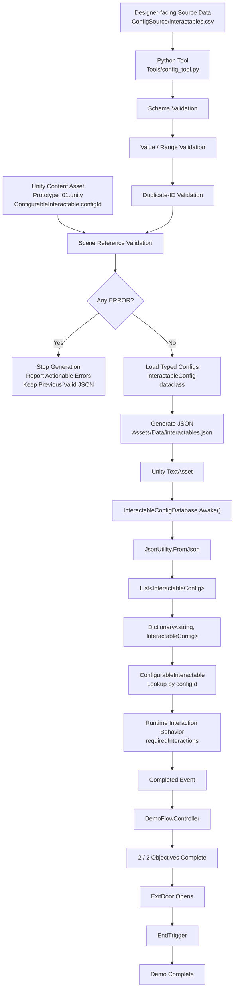

# Pipeline V1

## 1. Overview

This document describes the first complete end-to-end content pipeline of `TD-Pipeline-Demo`.

The pipeline connects designer-facing configuration data, Python validation and conversion, generated JSON data, Unity configuration loading, and final runtime gameplay behavior.

The current pipeline has been verified through an actual source-data modification test without manually editing generated JSON or gameplay C# code.

---

## 2. End-to-End Content Pipeline



---

## 3. Pipeline Stages

### 3.1 Designer-Facing Source Data

The editable source configuration is:

```text
ConfigSource/interactables.csv
```

The CSV currently defines:

* `id`
* `displayName`
* `requiredInteractions`
* `deactivateOnComplete`

The CSV is treated as the source of truth for interactable configuration.

Generated JSON should not be manually edited as part of the normal workflow.

---

### 3.2 Python Validation

The pipeline tool is:

```text
Tools/config_tool.py
```

Before generating JSON, the tool performs several validation stages.

#### Schema Validation

Checks:

* CSV header exists
* Required columns exist
* Required values are not empty

#### Value / Range Validation

Checks:

* `requiredInteractions` can be converted to an integer
* `requiredInteractions` is not below the valid minimum
* Unusually high interaction counts are reported
* `deactivateOnComplete` is either `true` or `false`

#### Duplicate-ID Validation

Checks whether multiple configuration rows use the same `id`.

Duplicate IDs are treated as `ERROR` because configuration IDs are used as lookup and reference keys.

#### Scene Reference Validation

The tool also reads:

```text
Assets/Scenes/Prototype_01.unity
```

and checks serialized `ConfigurableInteractable.configId` values.

Each scene `configId` must correspond to an ID defined in the source CSV.

This allows broken references caused by deleted or renamed configuration IDs to be detected before Unity runtime.

---

## 4. Validation Gate

Validation issues are represented using two severity levels:

```text
ERROR
WARNING
```

### ERROR

An `ERROR` means the generated configuration should not be trusted.

Examples include:

* missing required fields
* invalid integer values
* invalid boolean values
* invalid interaction ranges
* duplicate IDs
* broken Unity scene references

If any `ERROR` exists:

```text
Validation fails
↓
JSON generation stops
↓
Previous valid JSON remains unchanged
```

### WARNING

A `WARNING` represents suspicious but technically usable data.

For example:

```text
requiredInteractions = 50
```

is currently considered unusually high for the interaction design, but does not make the data structurally invalid.

Therefore:

```text
WARNING
↓
Report issue
↓
Continue JSON generation
```

---

## 5. Generated Data

If validation succeeds, the Python tool converts the source CSV into typed `InteractableConfig` objects and generates:

```text
Assets/Data/interactables.json
```

The generated JSON is the Unity-consumable output of the configuration pipeline.

Current transformation:

```text
CSV strings
↓
Python type conversion
↓
InteractableConfig dataclass
↓
Dictionary representation
↓
JSON
```

---

## 6. Unity Configuration Loading

Unity consumes the generated JSON through:

```text
InteractableConfigDatabase
```

At runtime:

```text
interactables.json
↓
TextAsset
↓
InteractableConfigDatabase.Awake()
↓
JsonUtility.FromJson
↓
InteractableConfigCollection
↓
List<InteractableConfig>
↓
Dictionary<string, InteractableConfig>
```

The dictionary uses configuration IDs as keys.

This allows runtime objects to retrieve configuration directly by `configId`.

---

## 7. Runtime Content

Each configurable gameplay object contains a serialized:

```text
configId
```

For example:

```text
SturdyCube
↓
configId = cube_sturdy
```

At runtime:

```text
ConfigurableInteractable
↓
Request config by configId
↓
InteractableConfigDatabase
↓
Dictionary lookup
↓
InteractableConfig
↓
Apply requiredInteractions
```

The gameplay logic itself does not need to change when the configuration value changes.

---

## 8. Gameplay Completion Flow

After an interactable reaches its configured completion condition:

```text
ConfigurableInteractable
↓
Completed event
↓
DemoFlowController
↓
completedObjectives++
```

After both objectives are complete:

```text
2 / 2 objectives
↓
ExitDoor disabled
↓
Exit opened
```

The player can then reach the end trigger:

```text
EndTrigger
↓
DemoFlowController.TryFinishMission()
↓
Demo Complete
```

---

## 9. Day 6 End-to-End Verification

Pipeline V1 was verified through a real source-data modification test.

### Baseline

The source configuration initially contained:

```text
cube_sturdy.requiredInteractions = 3
```

### Test Procedure

1. Ran the Python tool with the valid baseline configuration.
2. Confirmed validation passed and JSON generation succeeded.
3. Modified only the designer-facing CSV:

```text
cube_sturdy.requiredInteractions
3 → 5
```

4. Did not manually edit the generated JSON.
5. Did not modify gameplay C# code.
6. Ran:

```text
py Tools/config_tool.py
```

7. Confirmed generated JSON changed automatically to:

```text
requiredInteractions = 5
```

8. Ran the Unity prototype.
9. Entered the mission through `StartGate`.
10. Completed `QuickCube`.
11. Verified `SturdyCube` required exactly 5 interactions.
12. Completed both objectives.
13. Verified the exit opened normally.
14. Entered the end trigger.
15. Verified the full gameplay loop reached:

```text
Demo Complete
```

16. Restored the source CSV value:

```text
5 → 3
```

17. Regenerated JSON.
18. Confirmed the pipeline returned to the original valid configuration.

---

## 10. Verified Pipeline

The successful Day 6 test verifies the following complete chain:

```text
Designer Source Data
↓
Python Validation
↓
Automatic Conversion
↓
Generated JSON
↓
Unity Configuration Loading
↓
Runtime Config Lookup
↓
Gameplay Behavior
↓
Objective Completion
↓
Level Flow
↓
Demo Complete
```

The important result is that changing only the designer-facing source data produced a real runtime gameplay change without manually editing generated data or rewriting gameplay code.

---

## 11. Current Pipeline Boundaries

Pipeline V1 is intentionally limited to the current demo scope.

Known boundaries include:

* Reference validation currently scans `Prototype_01.unity` rather than all scenes and prefabs.
* Missing or completely malformed source files are not yet handled comprehensively.
* The Unity configuration database assumes its `TextAsset` reference is correctly assigned.
* The current pipeline does not provide a graphical user interface.
* Validation functions currently read the CSV separately rather than sharing one parsed intermediate representation.
* The current Unity reference validation is specific to this project's serialized `ConfigurableInteractable.configId` structure.

These are not current blockers.

Further robustness and edge-case testing are deferred to later sprint stages.

---

## 12. Pipeline V1 Summary

Pipeline V1 has now reached the following state:

```text
Designer-facing CSV
        +
Unity Scene References
        ↓
Python Preflight Validation
        ↓
ERROR / WARNING Gate
        ↓
Typed Configuration
        ↓
Generated JSON
        ↓
Unity Runtime Loading
        ↓
Config-Driven Gameplay
        ↓
Playable Demo Completion
```

The project now demonstrates not only a playable Unity prototype, but also a small content-production workflow in which configuration errors can be detected before runtime and source-data changes can propagate into real gameplay behavior.
