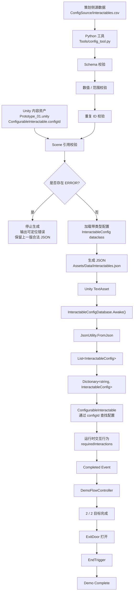

# Pipeline V1

[English](Pipeline_V1.md) | 简体中文

> **历史里程碑快照。** 本文档描述 Week 1 的单表 Pipeline V1 架构，用于保留项目演进过程，**不代表当前 Pipeline 的最终规格**。当前 V2 设计、QA 与量化结果请见 [`Pipeline_Case_Study.zh-CN.md`](Pipeline_Case_Study.zh-CN.md)。

## 1. 概述

本文档描述 `TD-Pipeline-Demo` 的第一版完整端到端内容生产管线（End-to-End Content Pipeline）。

这条管线连接了面向策划的配置数据、Python 校验与转换、生成后的 JSON 数据、Unity 配置加载，以及最终的运行时玩法行为。

Pipeline V1 已通过一次真实的源数据修改测试完成验证，整个过程中没有手动修改生成 JSON，也没有修改玩法 C# 代码。

---

## 2. 端到端内容管线



---

## 3. 管线阶段

### 3.1 策划侧源数据

可编辑源配置：

```text
ConfigSource/interactables.csv
```

V1 CSV 字段：

- `id`
- `displayName`
- `requiredInteractions`
- `deactivateOnComplete`

CSV 被视为 Interactable 配置的 Source of Truth，正常工作流中不手动修改 Generated JSON。

### 3.2 Python 校验

工具入口：

```text
Tools/config_tool.py
```

生成 JSON 前执行：

#### Schema Validation

- CSV header 存在
- required column 存在
- required value 非空

#### Value / Range Validation

- `requiredInteractions` 可以转换为整数
- `requiredInteractions` 不低于合法最小值
- 异常偏高的交互次数会被报告
- `deactivateOnComplete` 为 `true` / `false`

#### Duplicate-ID Validation

重复 ID 被视为 `ERROR`，因为 ID 同时承担运行时 Lookup Key 与 Reference Key。

#### Scene Reference Validation

Pipeline V1 读取：

```text
Assets/Scenes/Prototype_01.unity
```

并检查 `ConfigurableInteractable.configId` 是否对应源 CSV 中已有 ID。

这使删除 / 重命名配置导致的失效引用可以在 Runtime 前被发现。

---

## 4. Validation Gate

问题分为：

```text
ERROR
WARNING
```

### ERROR

表示当前生成配置不可信。

例如：

- required field 缺失
- invalid integer / boolean
- invalid interaction range
- duplicate ID
- broken Unity Scene reference

存在任意 `ERROR` 时：

```text
Validation fails
↓
停止 JSON 生成
↓
保留上一版合法 JSON
```

### WARNING

表示数据值得检查，但技术上仍可继续使用。

例如：

```text
requiredInteractions = 50
```

对于 V1 交互设计来说异常偏高，但不会让数据结构本身失效。

---

## 5. 生成数据

校验通过后，Python 工具把 CSV 转换为 Typed `InteractableConfig` 并生成：

```text
Assets/Data/interactables.json
```

转换过程：

```text
CSV strings
↓
Python 类型转换
↓
InteractableConfig dataclass
↓
Dictionary representation
↓
JSON
```

---

## 6. Unity 配置加载

Unity 通过：

```text
InteractableConfigDatabase
```

消费 Generated JSON：

```text
interactables.json
↓
TextAsset
↓
InteractableConfigDatabase.Awake()
↓
JsonUtility.FromJson
↓
InteractableConfigCollection
↓
List<InteractableConfig>
↓
Dictionary<string, InteractableConfig>
```

Dictionary 使用 Config ID 作为 Key，运行时对象可以通过 `configId` 获取配置。

---

## 7. 运行时内容

每个可配置对象包含序列化：

```text
configId
```

例如：

```text
SturdyCube
↓
configId = cube_sturdy
```

运行时：

```text
ConfigurableInteractable
↓
通过 configId 请求配置
↓
InteractableConfigDatabase
↓
Dictionary lookup
↓
InteractableConfig
↓
应用 requiredInteractions
```

配置数值变化时，玩法逻辑本身不需要修改。

---

## 8. 玩法完成流程

交互物达到完成条件：

```text
ConfigurableInteractable
↓
Completed event
↓
DemoFlowController
↓
completedObjectives++
```

两个目标完成后：

```text
2 / 2 objectives
↓
ExitDoor disabled
↓
出口打开
```

随后：

```text
EndTrigger
↓
DemoFlowController.TryFinishMission()
↓
Demo Complete
```

---

## 9. Day 6 端到端验证

Pipeline V1 通过真实 Source 修改测试验证。

基线：

```text
cube_sturdy.requiredInteractions = 3
```

测试过程：

1. 使用合法基线运行 Python 工具并确认 Generation PASS。
2. 只修改策划侧 CSV：

```text
cube_sturdy.requiredInteractions
3 → 5
```

3. 不手动修改 Generated JSON。
4. 不修改 Gameplay C#。
5. 运行：

```text
py Tools/config_tool.py
```

6. 确认 Generated JSON 自动变为 `requiredInteractions = 5`。
7. 运行 Unity 原型并完成完整任务流程。
8. 确认 `SturdyCube` 恰好需要 5 次交互。
9. 确认两个 Objective 完成后 Exit 正常打开并到达 `Demo Complete`。
10. 将源 CSV 恢复 `5 → 3` 并重新生成。

---

## 10. 已验证管线

Day 6 测试证明以下链路能够真实工作：

```text
策划侧源数据
↓
Python Validation
↓
Automatic Conversion
↓
Generated JSON
↓
Unity Configuration Loading
↓
Runtime Config Lookup
↓
Gameplay Behavior
↓
Objective Completion
↓
Level Flow
↓
Demo Complete
```

关键结果：**只修改策划侧源数据，就能够产生真实 Runtime Gameplay Change，而不需要手动编辑 Generated Data 或重写 Gameplay Code。**

---

## 11. Pipeline V1 历史边界

V1 当时有以下边界：

- Reference Validation 只扫描 `Prototype_01.unity`；
- 缺失 / 完全畸形 Source File 尚未完整处理；
- Unity Config Database 假设 `TextAsset` 已正确绑定；
- 没有 GUI；
- 各 Validation Function 分别读取 CSV，而不是共享 Parse Once Intermediate Model；
- Unity Reference Validation 只覆盖 `ConfigurableInteractable.configId`。

其中多项边界后来已经在 Pipeline V2 中得到处理。当前最终架构与证据请以 Pipeline Case Study 为准。

---

## 12. Pipeline V1 总结

```text
策划侧 CSV
        +
Unity Scene References
        ↓
Python Preflight Validation
        ↓
ERROR / WARNING Gate
        ↓
Typed Configuration
        ↓
Generated JSON
        ↓
Unity Runtime Loading
        ↓
Config-Driven Gameplay
        ↓
Playable Demo Completion
```

Pipeline V1 证明了一个小型内容生产工作流：配置错误能够在 Runtime 前被发现，策划侧 Source Change 也能够传播到真实 Gameplay Behavior。本文档作为后续 V2 架构的历史基线保留。
