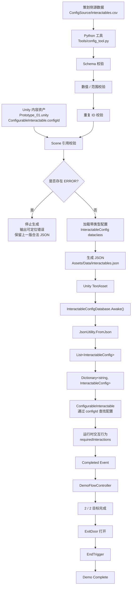

# Pipeline V1

## 1. 概述

本文档描述 `TD-Pipeline-Demo` 的第一版完整端到端内容生产管线（End-to-End Content Pipeline）。

这条管线连接了面向策划的配置数据、Python 校验与转换、生成后的 JSON 数据、Unity 配置加载，以及最终的运行时玩法行为。

当前管线已经通过一次真实的源数据修改测试完成验证，整个过程中没有手动修改生成 JSON，也没有修改玩法 C# 代码。

---

## 2. 端到端内容管线



---

## 3. 管线阶段

### 3.1 策划侧源数据

可编辑源配置位于：

```text
ConfigSource/interactables.csv
```

当前 CSV 定义以下字段：

- `id`
- `displayName`
- `requiredInteractions`
- `deactivateOnComplete`

CSV 被视为当前交互物配置的 Source of Truth（源数据真值）。

正常工作流中不应手动修改生成后的 JSON。

---

### 3.2 Python 校验

管线工具位于：

```text
Tools/config_tool.py
```

在生成 JSON 之前，工具会执行多个校验阶段。

#### Schema Validation（结构校验）

检查：

- CSV 是否存在表头
- 必需列是否存在
- 必需字段值是否为空

#### Value / Range Validation（数值 / 范围校验）

检查：

- `requiredInteractions` 是否可以转换为整数
- `requiredInteractions` 是否低于合法最小值
- 是否存在异常偏高的交互次数
- `deactivateOnComplete` 是否为 `true` 或 `false`

#### Duplicate-ID Validation（重复 ID 校验）

检查多条配置是否使用了相同 `id`。

重复 ID 被视为 `ERROR`，因为配置 ID 同时承担运行时查找键和引用键的作用。

#### Scene Reference Validation（场景引用校验）

工具还会读取：

```text
Assets/Scenes/Prototype_01.unity
```

并检查其中序列化的 `ConfigurableInteractable.configId`。

每一个 Scene 中的 `configId` 都必须对应源 CSV 中已经定义的 ID。

这样就可以在 Unity Runtime 之前发现因配置 ID 删除或重命名导致的失效引用。

---

## 4. 校验门（Validation Gate）

校验问题分为两个严重级别：

```text
ERROR
WARNING
```

### ERROR

`ERROR` 表示当前生成配置不可信，不应继续进入下游流程。

例如：

- 必需字段缺失
- 非法整数值
- 非法布尔值
- 非法交互范围
- 重复 ID
- Unity Scene 中失效的配置引用

如果存在任意 `ERROR`：

```text
Validation fails
↓
停止 JSON 生成
↓
保留上一版合法 JSON
```

### WARNING

`WARNING` 表示数据值得检查，但技术上仍可继续使用。

例如：

```text
requiredInteractions = 50
```

对于当前交互设计来说，这个数值异常偏高，但并不会让数据结构本身失效。

因此：

```text
WARNING
↓
输出提示
↓
继续生成 JSON
```

---

## 5. 生成数据

如果所有校验都通过，Python 工具会将 CSV 转换为带类型的 `InteractableConfig` 对象，并生成：

```text
Assets/Data/interactables.json
```

该 JSON 是配置管线提供给 Unity 的可消费输出。

当前转换过程：

```text
CSV strings
↓
Python 类型转换
↓
InteractableConfig dataclass
↓
Dictionary representation
↓
JSON
```

---

## 6. Unity 配置加载

Unity 通过以下组件消费生成 JSON：

```text
InteractableConfigDatabase
```

运行时流程：

```text
interactables.json
↓
TextAsset
↓
InteractableConfigDatabase.Awake()
↓
JsonUtility.FromJson
↓
InteractableConfigCollection
↓
List<InteractableConfig>
↓
Dictionary<string, InteractableConfig>
```

Dictionary 使用配置 ID 作为键。

因此运行时对象可以直接通过 `configId` 获取对应配置。

---

## 7. 运行时内容

每一个可配置玩法对象都包含一个序列化字段：

```text
configId
```

例如：

```text
SturdyCube
↓
configId = cube_sturdy
```

运行时：

```text
ConfigurableInteractable
↓
通过 configId 请求配置
↓
InteractableConfigDatabase
↓
Dictionary lookup
↓
InteractableConfig
↓
应用 requiredInteractions
```

当配置数值改变时，玩法逻辑本身不需要修改。

---

## 8. 玩法完成流程

当一个交互物达到自身配置的完成条件后：

```text
ConfigurableInteractable
↓
Completed event
↓
DemoFlowController
↓
completedObjectives++
```

两个目标全部完成后：

```text
2 / 2 objectives
↓
ExitDoor disabled
↓
出口打开
```

随后玩家可以进入结束 Trigger：

```text
EndTrigger
↓
DemoFlowController.TryFinishMission()
↓
Demo Complete
```

---

## 9. Day 6 端到端验证

Pipeline V1 通过一次真实的源数据修改测试完成验证。

### 基线

初始源配置为：

```text
cube_sturdy.requiredInteractions = 3
```

### 测试过程

1. 使用合法基线配置运行 Python 工具。
2. 确认校验通过且 JSON 成功生成。
3. 只修改策划侧 CSV：

```text
cube_sturdy.requiredInteractions
3 → 5
```

4. 不手动修改生成 JSON。
5. 不修改玩法 C# 代码。
6. 运行：

```text
py Tools/config_tool.py
```

7. 确认生成 JSON 自动更新为：

```text
requiredInteractions = 5
```

8. 运行 Unity 原型。
9. 通过 `StartGate` 开始任务。
10. 完成 `QuickCube`。
11. 确认 `SturdyCube` 恰好需要 5 次交互。
12. 完成两个目标。
13. 确认出口正常打开。
14. 进入结束 Trigger。
15. 确认完整玩法流程到达：

```text
Demo Complete
```

16. 将源 CSV 恢复为：

```text
5 → 3
```

17. 重新生成 JSON。
18. 确认管线回到原始合法基线状态。

---

## 10. 已验证管线

Day 6 测试证明以下完整链路能够真实工作：

```text
策划侧源数据
↓
Python Validation
↓
Automatic Conversion
↓
Generated JSON
↓
Unity Configuration Loading
↓
Runtime Config Lookup
↓
Gameplay Behavior
↓
Objective Completion
↓
Level Flow
↓
Demo Complete
```

关键结果是：**只修改策划侧源数据，就能够产生真实的运行时玩法变化，而不需要手动编辑生成数据或重写玩法代码。**

---

## 11. 当前管线边界

Pipeline V1 当前刻意限制在本 Demo 的实际范围内。

已知边界包括：

- 引用校验目前只扫描 `Prototype_01.unity`，而不是所有 Scene 与 Prefab
- 缺失或完全畸形的源文件尚未被完整处理
- Unity 配置数据库默认 Inspector 中的 `TextAsset` 引用已经正确绑定
- 当前管线没有 GUI
- 各 Validation 函数目前分别读取 CSV，而不是共享一个解析后的中间表示
- 当前 Unity 引用校验只针对本项目序列化的 `ConfigurableInteractable.configId` 结构

这些都不是当前 blocker。

更进一步的鲁棒性与边界 Case 测试会留到后续冲刺阶段处理。

---

## 12. Pipeline V1 总结

Pipeline V1 当前已经达到：

```text
策划侧 CSV
        +
Unity Scene References
        ↓
Python Preflight Validation
        ↓
ERROR / WARNING Gate
        ↓
Typed Configuration
        ↓
Generated JSON
        ↓
Unity Runtime Loading
        ↓
Config-Driven Gameplay
        ↓
Playable Demo Completion
```

当前项目已经不仅包含一个可玩的 Unity 原型，也形成了一条小型内容生产工作流：配置错误可以在进入运行时之前被发现，策划侧源数据的修改也能够真实传播到最终玩法行为。
