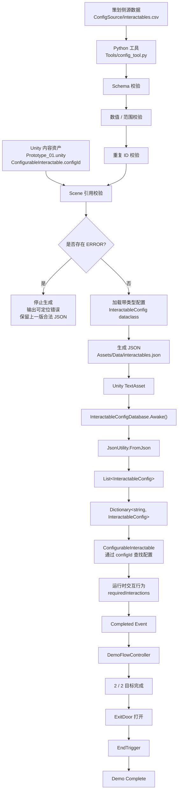

# Pipeline V1 — Week 1 快照

[English](Pipeline_V1.md) | 简体中文

> 范围：Week 1 单表管线及 Day 6 验证。当前工具 V3 见[案例说明](Pipeline_Case_Study.zh-CN.md)、[技术实现](技术实现.md)和[使用说明](使用说明.md)。下文命令与组件行为描述的是 V1 里程碑。

## 1. 概述与流程

V1 将策划编写的 CSV、Python 校验与类型转换、JSON 生成、Unity 配置加载和玩法完成连成一条流程。验证时只修改源数据，生成数据和玩法 C# 沿用已有管线与运行逻辑。



## 2. 源数据与校验

`ConfigSource/interactables.csv` 是可编辑源文件，包含四个字段：`id`、`displayName`、`requiredInteractions`、`deactivateOnComplete`。日常内容修改在 CSV 中完成，再通过 `Tools/config_tool.py` 生成 `Assets/Data/interactables.json`。

V1 在生成前检查：

| 检查项 | 要求 |
| --- | --- |
| 表结构 | 表头和必需列存在，必填值非空 |
| 整数与范围 | `requiredInteractions` 能转为整数并达到最小值；异常偏高时提示 |
| 布尔值 | `deactivateOnComplete` 为 `true` 或 `false` |
| ID 唯一性 | ID 用于查找与引用，因此不得重复 |
| 场景引用 | `Assets/Scenes/Prototype_01.unity` 中序列化的 `ConfigurableInteractable.configId` 均存在于 CSV |

场景检查可在运行前发现删除或重命名配置造成的引用失效。

**ERROR** 包括缺少字段、整数/布尔/范围错误、重复 ID 和失效场景引用，会停止生成并保留原有合法 JSON。**WARNING** 提示可继续使用但值得检查的数据，允许生成；当时以 `requiredInteractions = 50` 作为次数偏高的示例。

通过校验后，CSV 字符串转换为带类型的 `InteractableConfig` dataclass 实例，再转为字典并输出 JSON。

## 3. Unity 加载与玩法

加载路径：

```text
interactables.json → TextAsset → InteractableConfigDatabase.Awake()
→ JsonUtility.FromJson → InteractableConfigCollection
→ List<InteractableConfig> → Dictionary<string, InteractableConfig>
```

字典以配置 ID 为键。场景对象持有序列化的 `configId`，例如 `SturdyCube` 使用 `cube_sturdy`。`ConfigurableInteractable` 向 `InteractableConfigDatabase` 请求该 ID，取得配置后应用 `requiredInteractions`。调整数值无需修改玩法代码。

完成流程：

```text
ConfigurableInteractable 达到配置的交互次数
→ Completed 事件 → DemoFlowController → completedObjectives++
→ 2 / 2 目标完成 → 停用 ExitDoor → 出口打开
→ 玩家进入 EndTrigger → DemoFlowController.TryFinishMission()
→ Demo Complete
```

## 4. Day 6 端到端验证

基线为 `cube_sturdy.requiredInteractions = 3`。

1. 使用合法基线运行 Python 工具，确认校验与生成通过。
2. 只将 CSV 中的值从 `3 → 5`，保持生成 JSON 和玩法 C# 原样。
3. 运行 `py Tools/config_tool.py`，确认 JSON 自动变为 `requiredInteractions = 5`。
4. 运行 Unity 原型，经 `StartGate` 开始任务，完成 `QuickCube`。
5. 确认 `SturdyCube` 恰好需要 5 次交互；两个目标完成后检查出口打开。
6. 进入终点触发器，确认到达 `Demo Complete`。
7. 将 CSV 恢复为 `5 → 3`，重新生成 JSON，确认恢复原合法配置。

这次测试验证了源数据编辑、校验、自动转换、JSON 加载、运行时查找、交互行为变化、目标完成和关卡完成的整条链路。

## 5. V1 边界与后续变化

Week 1 当时的范围：

- 引用校验只覆盖 `Prototype_01.unity` 和项目内序列化的 `ConfigurableInteractable.configId` 格式；
- 缺失或完全破损的源文件尚未完整处理；
- Unity 数据库假设 `TextAsset` 已正确绑定；
- 没有 GUI；
- 各校验函数独立读取 CSV，尚未共享解析结果；
- 全场景与全 prefab 扫描未纳入范围。

V2 后续引入共享多表模型，并扩展物品和场景检查。V3 在保持 Unity 运行时格式的基础上加入独立 GUI/EXE、外部规则、草稿与可选 AI 规则编写。本文保留 V1 架构，以及最初建立“源数据修改影响玩法”这条基线的验证过程。
